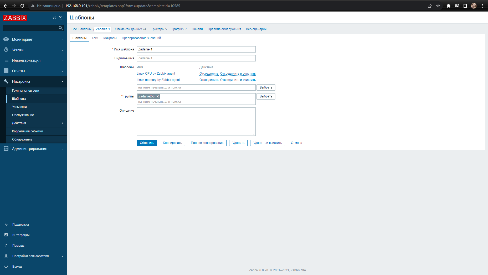
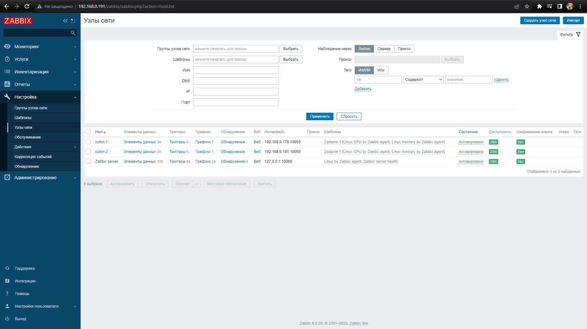
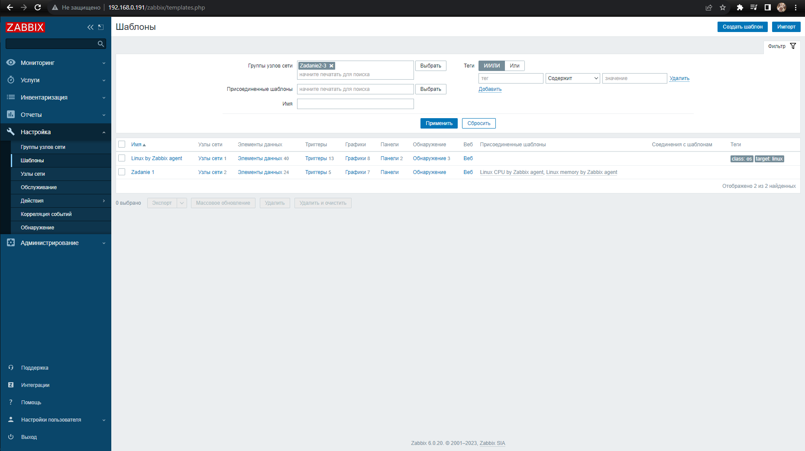
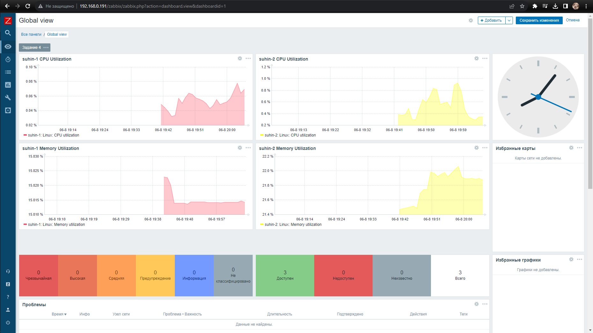

# Домашнее задание к занятию 9.3 «Система мониторинга Zabbix. Часть 2»

### Задание 1

Создайте свой шаблон, в котором будут элементы данных, мониторящие загрузку CPU и RAM хоста.

*Сохраните в Git скриншот страницы шаблона с названием «Задание 1».*

 ---

### Задание 2

Добавьте в Zabbix два хоста и задайте им имена <фамилия и инициалы-1> и <фамилия и инициалы-2>. Например: ivanovii-1 и ivanovii-2.

*Результат этого задания сдавайте вместе с заданием 3.*

 ---

### Задание 3

Привяжите созданный шаблон к двум хостам. Также привяжите к обоим хостам шаблон Linux by Zabbix Agent.

Сохраните в Git скриншот страницы хостов, где будут видны привязки шаблонов с названиями «Задание 2-3». Хосты должны иметь зелёный статус подключения.

Zabbix не даёт присоединить к хостам шаблон "Linux by Zabbix agent", т.к. в нем уже используются итемы в шаблоне Zadanie 2-3. Так что я решил привязать группу хостов к шаблонам

---

### Задание 4

Создайте свой кастомный дашборд.

*Сохраните в Git скриншот дашборда с названием «Задание 4».*

 ---
